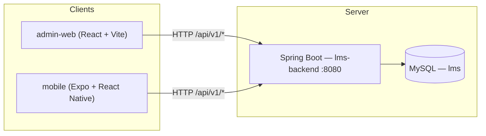

# LMS platform — repository layout and shared API architecture

This document explains how the **Web Admin**, **Mobile app**, and **Backend** fit together, how the folder structure is organized, and how both clients use the **same REST API**.

---

## 1. High-level architecture



- **One backend** (`backend/`) exposes JSON REST endpoints under **`/api/v1/...`**.
- **Web Admin** (`admin-web/`) calls those URLs as **`/api/v1/...`** from the browser. During local development, Vite **proxies** `/api` to the backend so the browser stays on the same origin (no CORS issues for dev).
- **Mobile** (`mobile/`) is an **Expo** app. It must call the backend using a **full base URL** (for example `http://10.0.2.2:8080` on Android emulator, or `http://<your-LAN-IP>:8080` on a physical device). The paths are still **`/api/v1/...`**. When you implement the mobile API layer, reuse the same routes and payloads as the admin web.

---

## 2. Folder structure (where everything lives)

The Git / workspace root used here is **`ai-fullstack`**. The LMS product code lives under **`lms-platform/`** as an **npm workspaces** monorepo (Node 18+).

```
ai-fullstack/
└── lms-platform/                    ← product root (npm workspaces root)
    ├── package.json                 ← workspaces: design-tokens, admin-web, mobile
    ├── database/                    ← MySQL scripts (schema for backend)
    │   ├── LMS_MYSQL_COPY_PASTE_SETUP.sql
    │   └── lms_full_setup.sql
    ├── docs/                        ← architecture / handoff documents (this file)
    ├── packages/
    │   └── design-tokens/           ← @lms/design-tokens (shared theme tokens)
    ├── admin-web/                   ← Web Admin (React + TypeScript + Vite)
    ├── mobile/                      ← Mobile shell (Expo + React Native; API wiring TBD)
    └── backend/                     ← Spring Boot API (Java 17, not an npm workspace)
```

### Why it is laid out this way

| Folder | Role |
|--------|------|
| **`lms-platform/`** | Single place for “everything LMS”: install once with `npm install` at this level for Node workspaces. |
| **`packages/design-tokens`** | Shared design system package. **admin-web** imports it for theme colors, typography, etc. Mobile can consume the same tokens later (the package also targets React Native theming where applicable). |
| **`admin-web/`** | Browser admin UI: leads, configuration modules, reports shell, auth against the backend. |
| **`mobile/`** | React Native app scaffold (Expo). It is in the monorepo so it can share **versioning**, **tokens**, and **API contracts** with admin; network calls will target the same backend base URL + `/api/v1`. |
| **`backend/`** | Maven project (`pom.xml`), not listed in npm `workspaces`, but lives **next to** the frontends so one clone gives you full stack. |
| **`database/`** | Portable **MySQL DDL** so any environment (or teammate machine) can create the `lms` schema without relying only on Hibernate `ddl-auto`. |

The **`backend`** folder was created as a standard **Spring Boot** layout (`src/main/java`, `src/main/resources/application.yml`). The **`admin-web`** and **`mobile`** folders were created as **Vite** and **Expo** scaffolds respectively, then wired into **`lms-platform/package.json`** via the **`workspaces`** array so a single `npm install` at `lms-platform` installs shared tooling and links `@lms/design-tokens` into admin-web.

---

## 3. Shared API — routes and contracts

The backend application name is **`lms-backend`** (see `backend/pom.xml`). It listens on **port 8080** by default (`backend/src/main/resources/application.yml`).

### Main API prefixes (same for Admin and Mobile)

| Prefix | Purpose |
|--------|---------|
| **`/api/v1/auth`** | Login, JWT issuance, session-related endpoints. |
| **`/api/v1/leads`** | Lead CRUD, listing, filters, reassignment. |
| **`/api/v1/config`** | Admin configuration masters, mappings, bulk upload audit, links, attendance, etc. |

OpenAPI / Swagger UI is configured under Springdoc (see `application.yml`: **`/swagger-ui.html`**, API docs **`/api/v3/api-docs`**). Use that as the **contract of record** for both web and mobile.

### Authentication

Clients send **`Authorization: Bearer <jwt>`** after login. The Web Admin stores the token in **`sessionStorage`** and attaches it in `admin-web/src/api/httpClient.ts`. Mobile should use the same header shape when you add a small API client (e.g. `fetch` or `axios` with an interceptor).

---

## 4. How Web Admin reaches the backend (development vs production)

### Development (typical)

1. Start **MySQL** and apply schema from **`database/LMS_MYSQL_COPY_PASTE_SETUP.sql`** (or `lms_full_setup.sql`).
2. Start **Spring Boot** on **http://localhost:8080**.
3. Start **Vite**: from `lms-platform`, run `npm run dev -w admin-web`.

`admin-web/vite.config.ts` proxies:

- Browser request: **`http://localhost:5173/api/...`**
- Forwarded to: **`http://localhost:8080/api/...`**

The admin API client uses paths like **`/api/v1/leads`** with an empty site prefix (`httpClient.ts` uses `defaultBase = ""`), so the browser hits the Vite origin and the proxy forwards to Spring Boot.

### Production

You typically deploy the **built** admin static files behind a reverse proxy that routes **`/api`** to the same host’s Spring Boot service (or to an API gateway). Mobile and other clients then use the **public base URL** + **`/api/v1/...`**.

---

## 5. How Mobile should use the same backend

Today, **`mobile/App.tsx`** is a minimal Expo placeholder. When you implement features:

1. Choose a **configurable base URL** (env or `app.config.js`), e.g. `https://api.yourcompany.com` or `http://192.168.1.10:8080` for LAN testing.
2. Call **`${BASE_URL}/api/v1/auth/...`**, **`${BASE_URL}/api/v1/leads/...`**, **`${BASE_URL}/api/v1/config/...`** — the same paths as the web app.
3. For **Android emulator**, `localhost` on the host is often **`http://10.0.2.2:8080`**.
4. Enable **CORS** on the backend if the mobile app (or Expo web) runs on a **different origin** than the API; for native apps calling by IP/HTTPS, follow your security model (HTTPS, pinning, etc.).

No second “mobile-only” API is required: **one codebase in `backend/`**, **one OpenAPI surface**, **two clients**.

---

## 6. Database

- Schema scripts: **`lms-platform/database/`**.
- Default JDBC URL in `application.yml` points at **`jdbc:mysql://localhost:3306/lms`** with credentials overridable via **`DB_URL`**, **`DB_USER`**, **`DB_PASSWORD`** environment variables.

---

## 7. Common commands (from `lms-platform`)

| Goal | Command |
|------|---------|
| Install Node deps (all workspaces) | `npm install` |
| Build design tokens | `npm run build -w @lms/design-tokens` |
| Run Web Admin (dev) | `npm run dev -w admin-web` |
| Build Web Admin | `npm run build -w admin-web` |
| Test Web Admin | `npm run test -w admin-web` |
| Run Mobile (Expo) | `npm run start -w mobile` |
| Run Backend | From `backend/`, run the Spring Boot main class or `mvn spring-boot:run` (requires Maven on PATH). |

---

## 8. Related documents

- **MySQL copy-paste setup:** `lms-platform/database/LMS_MYSQL_COPY_PASTE_SETUP.sql` (primary keys, foreign keys, indexes, verification queries).

---

## 9. Summary

| Question | Answer |
|----------|--------|
| Do Web Admin and Mobile use the same backend? | **Yes** — same Spring Boot app and **`/api/v1/*`** REST API. |
| Why is `backend` next to `admin-web` and `mobile`? | **One repo / one product**: easier onboarding, shared versioning, and a single source of truth for APIs and SQL. |
| How was the folder structure created? | **npm workspaces** for Node packages (`admin-web`, `mobile`, `packages/design-tokens`) plus a **Maven** Spring Boot project in **`backend/`**, and **`database/`** for portable DDL. |

If you add CI/CD or deployment diagrams later, extend this file under `lms-platform/docs/` so the team keeps a single documentation hub.
